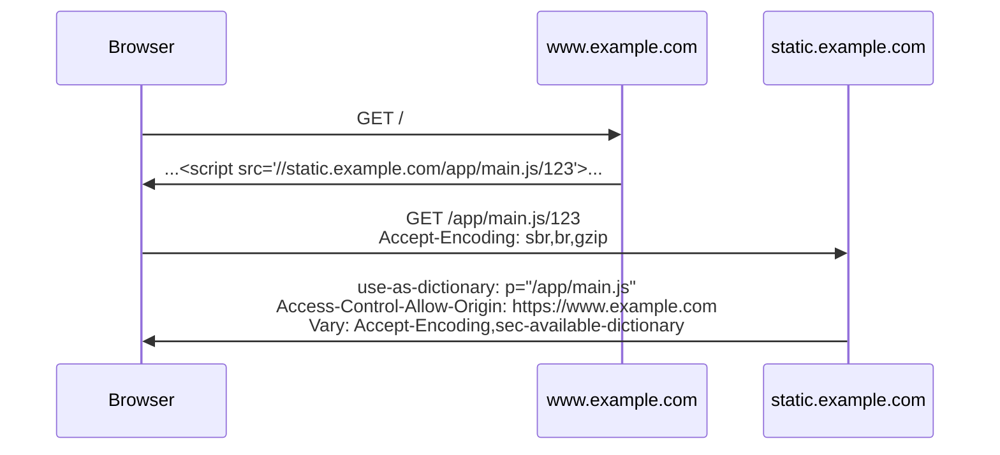
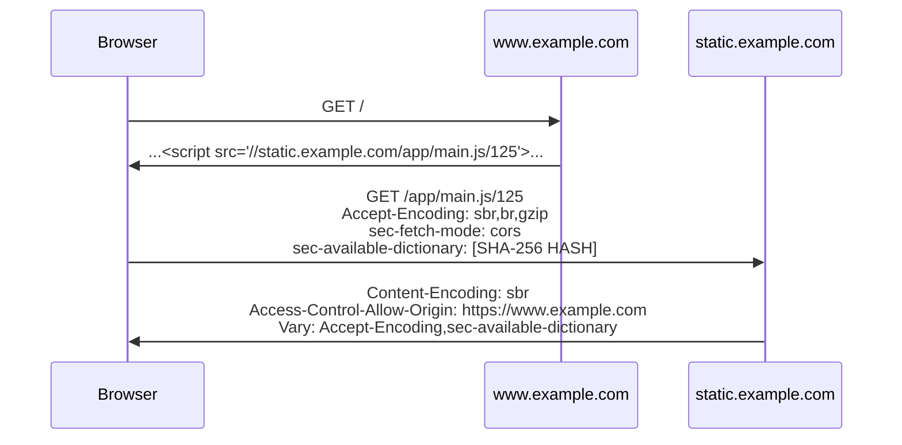
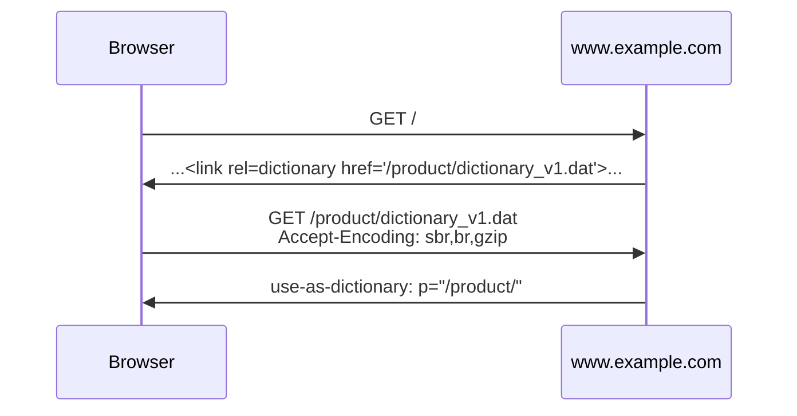
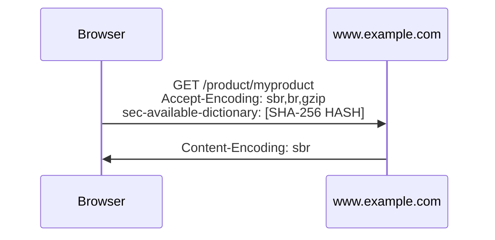

# Compression dictionary transport

## What is this?
This explainer outlines the benefits of compression dictionaries, details the different use case for them, and then proposes a way to deliver such dictionaries to browsers to enable these use cases.

## Summary
This proposal adds support for using designated previous responses, as an external dictionary for [Brotli](https://github.com/google/brotli)-compressing HTTP responses. 

HTTP `Content-Encoding` is extended with a new encoding type and support for allowing responses to be used as dictionaries for future requests. *All actual header values and names still TBD*:

* Server responds to a request for a cacheable resource with an `use-as-dictionary: <options>`.
* The client will store a hash of the uncompressed response and the applicable `path` for the resource with the cached response to identify it as a dictionary.
* On future requests, the client will match a request against an available dictionary with the best-matching `path`. If a dictionary is available for a given request, the client will add `sbr` to the `Accept-Encoding` request header as well as a `sec-available-dictionary: <SHA-256>` header with the hash of the best available dictionary (only SHA-256 is currently supported).
* If the server has a compressed version of the request URL with the matching dictionary, it serves the dictonary-compressed response with `Content-Encoding: sbr` and `Vary: Accept-Encoding,sec-available-dictionary`.

For interop reasons, `sbr` compression is only supported on secure contexts (similar to brotli compression).

There are also some browser-specific features independent of the transport compression:
* For security and privacy reasons, there are [CORS](https://fetch.spec.whatwg.org/#http-cors-protocol) requirements ([detailed below](#security-mitigations)) for both the dictionary and compressed resource.
* In order to populate a dictionary for future use, a server can respond with link tag or header to trigger an idle-time fetch specifically for a dictionary for future use. e.g. `<link rel=dictionary href=[dictionary_url]>`.

## Background
### What are compression dictionaries?
Compression dictionaries are bits of compressible content known ahead of time. They are being used by compression engines to reduce the size of compressed content.

Because they are known ahead of time, the compression engine can refer to the content in the dictionary when representing the compressed content, reducing the size of the compressed payload. The decompression engine can then interpret the content based on that pre-defined knowledge..

Taken to the extreme, if the compressed content is identical to the dictionary, the entire delivered content be a few bytes referring to the dictionary.

Now, you may ask, if dictionaries are so awesome, then...

### Why aren't browsers already using compression dictionaries?

To some extent, they are. The brotli compression scheme includes a [built-in dictionary](https://github.com/google/brotli/tree/master/c/common) that was built to work reasonably well for HTML, CSS and JavaScript. Custom (shared) dictionaries have a more complicated history.

At some point, Chrome did support a shared compression dictionary.
When Chrome was first released, it supported a dictionary compression method called [SDCH](https://en.wikipedia.org/wiki/SDCH) (Shared-dictionary Compression over HTTP).
That support was [unshipped](https://groups.google.com/a/chromium.org/g/blink-dev/c/nQl0ORHy7sw/m/HNpR96sqAgAJ) in 2016 due to complexities around the protocol’s implementation, specification and lack of an interoperability story.

SDCH enabled Chrome and Chromium-based browsers to create origin-specific dictionaries, that were downloaded once for the origin and enabled multiple pages to be compressed with significantly higher rates.
That's one use case for compression dictionaries we will call the "Shared dictionary" use case.

There's another major use case for shared dictionaries that was never supported by browsers - [delta compression](https://en.wikipedia.org/wiki/Delta_encoding).

That use-case would enable the browser to reuse past resources (e.g. your site's main JS v1.2) in order to compress future ones (e.g. main JS v1.3).
But traditionally, this use-case raised complexities around the abilities of the browser to coordinate its cache state with the server, and agree on what the dictionary would be. It also raised issues with both sides having to store all past versions of each resource in order to successfully be able to compress and decompress it.

The common thread is that the use of compression dictionaries had run into various complexities over the years which resulted in deployment issues.

### This time will be different

A few things about this current proposal are different from past attempts, in ways we're hoping are meaningful:
* CORS-based restrictions can ensure that public and private resources don't get mixed in ways that can leak user data.
* Path-based scoping would help us manage a "single possible dictionary per request" policy, which will minimize client-side cache fan-out.
* Dictionaries must already be available on the client to be used (fetching of the dictionary is not in the critical path of a resource fetch).
* Diff-caching on the server can simplify and enable the server-side deployment story.

## Use cases

### Compression types

There are two primary models for using shared dictionaries that are similar but differ in how the dictionary is fetched:

* Delta compression - reusing past downloaded resources for compressing future updates of the same or similar resources.
* Shared dictionary - a dedicated dictionary is downloaded out-of-band, and then used to compress and decompress resources on the page.

In both cases the client advertises the best-available dictionary that it has for a given request. If the server has a delta-compressed version of the resource, compressed with the advertized dictionary, it can just send that delta-compressed diff. It can also use that advertized dictionary (if available) to dynamically compress that resource.

With the `Delta compression` use case, a previously-downloaded version of the resource is available to use for future requests as a dictionary. For example, with a JavaScript file, v1 of the file may be in the browser's cache and available for use as a dictionary to use when fetching v2 so only the difference between the two needs to be transmitted.

In the `Shared dictionary` use case, the dictionary is a purpose-built dictionary that is fetched using a `<link>` tag and can be used for future requests that match the `path` covered by the dictionary. For example, on a first visit to a site, the HTML response references a custom dictionary that should be used for `document` fetches for that origin. The dictionary is downloaded at some point by the browser and, on future navigations through the site, is advertised as being available for document requests that match the path of the dictionary.

## Risks

### Security

The Shared Brotli draft does a good job [describing](https://datatracker.ietf.org/doc/html/draft-vandevenne-shared-brotli-format-08#section-10) the security risks. I’ll try to summarize that here:

* [CRIME](https://en.wikipedia.org/wiki/CRIME) and [BREACH](https://en.wikipedia.org/wiki/BREACH) mean that both the resource being compressed and the dictionary itself can be considered readable by the document deploying them. That is Bad™ if any of them contains information that the document cannot already obtain by other means.
* An out-of-band dictionary needs to be carefully examined to ensure that it wasn’t created using users’ private data, nor using content that’s user controlled.

### Privacy

Dictionaries will need to be cached using a triple key (top-level site, nested context site, URL) similar to other cached resources (or any other partitioning scheme that’s good enough for cached resources from a privacy and security perspective). That’s not an issue for the delta compression use case, but can become a burden fast for the out-of-band dictionaries, as multiple nested contexts may need to download the same dictionary multiple times)

**_Note:_** [Common payload caching](https://groups.google.com/a/chromium.org/g/blink-dev/c/9xWJK3IgJb4) may be useful in such cases.

There’s also the issue of users advertising resource versions in their cache to servers as part of the request. This already has a precedence in terms of cache validators (ETags, If-Modified-Since), so maybe that’s fine, given that the cache is partitioned.

### Adverse performance effects

Downloading an out-of-band dictionary means that the site owner is making a certain bet regarding the amount of visits that would enable the user to amortize that dictionary’s cost.

At worst, if the user never visits the site again until the dictionary’s lifetime expires, the user has paid the cost of downloading the dictionary with no benefits.

For some large and heavily trafficked sites, that case is rare. For others, it’s extremely common, and we should be wary of both the tools we’d be putting in developers’ hands, as well as the messaging we’re providing them regarding when to use them.

## Proposal

### Static resources flow

In this flow, we’re reusing static resources themselves as dictionaries that would be used to compress future updates of themselves, or similar resources.

* [example.com](http://example.com/) downloads [example.com/large-module.wasm](http://example.com/large-module.wasm) for the first time.
* The response for [example.com/large-module.wasm](http://example.com/large-module.wasm) contains a `use-as-dictionary: <options>` response header. The options are a [structured field dictionary](https://www.rfc-editor.org/rfc/rfc8941.html#name-dictionaries) that includes the ability to set path, expiration and preferred hashes. More details [here](#dictionary-options-header).
* The client saves the path and a SHA-256 hash of the resource with the cached resource.
    * For browser clients, the response must also be non-opaque in order to be used as a dictionary. Practically, this means the response is either same-origin as the document or has an `Access-Control-Allow-Origin:` header that makes the response readable by the document.
* The next time the browser fetches a resource from a path covered by a dictionary in cache, it includes a `sec-available-dictionary:` request header, which lists a **single** hash (lowercase hex)
    * The request is limited to specifying a **single** dictionary hash both to reduce the header overhead and limit the cardinality of the `sec-available-dictionary:` request header (to limit variations in the `Vary` caches).
    * The `sec-` prefix is there to ensure that requests are not attacker-generated.
    * Any new resource as a dictionary for that path would override older ones. When sending requests, the browser would use the _most specific path_ for the request to get its dictionary. Path specificity is determined by the string length of the path specified with the dictionary.
    * The different SHA hash algorithms have different lengths so the actual algorithm doesn't need to be specified.
    * The hex representation of a SHA-256 hash is relatively long at 64 bytes and it could be reduced to ~42 bytes if bas64 was used. By specifying the lowecase hex representation it makes processing of the request on the server much easier (and the hash value can be directly matched to part of a filename on-disk).
* When the server gets a request with the `sec-available-dictionary` header in it:
    * If the client sent a `sec-fetch-mode: cors` request header then the dictionary should be ignored unless the response will have an `Access-Control-Allow-Origin:` response header that includes the origin of the page the request was issued from (`*` or matched against the `origin:` or `referer:`).
    * The server can simply ignore the dictionary if it doesn't have a diff that corresponds to said dictionary. In that case the server can serve the response without delta compression.
    * If the server does have a corresponding diff, it can respond with that, indicating that as part of its `content-encoding` header. There's no need to repeat the hash value, as there's only one.
      - For example, if we're using [shared brotli compression](https://datatracker.ietf.org/doc/draft-vandevenne-shared-brotli-format/), the `content-encoding: sbr` header would respond with `Content-Encoding: sbr`.
* In case the browser advertized a dictionary but then fails to successfully fetch it from its cache *and* the dictionary was used by the server, the resource request should fail.
* For browser clients, the response must be non-opaque in order to be decompressed with a shared dictionary. Practically, this means the response is either same-origin as the document or has an `Access-Control-Allow-Origin:` header that makes the response readable by the document.

### Dynamic resources flow

* Shared dictionary is declared ahead-of time and then downloaded out of band using a `Link:` header on the document response or `<link>` HTML tag with a `rel=dictionary` type.
    * The dictionary resource will be downloaded with CORS in “omit” mode to discourage including user-specific private data in the dictionary, since its data will be readable without credentials.
    * It will be downloaded with “idle” priority, once the site is actually idle.
    * Browsers may decide to not download it when they suspect that the user is paying for bandwidth, or when used by sites that are not likely to amortize the dictionary costs (e.g. sites that the user isn’t visiting frequently enough).
    * Browsers may decide to not use a shared dictionary if it contains hints that its contents are not public (e.g. `Cache-Control: private` headers).
* The dictionary response must include the `use-as-dictionary: <options>` header, appropriate cache lifetime headers and will be used for future requests using the same process as the [Static resources flow](#static-resources-flow).
    * For browser clients, the response must also be non-opaque in order to be used as a dictionary. Practically, this means the response is either same-origin as the document or has an `Access-Control-Allow-Origin:` header that makes the response readable by the document.

### Dictionary options header
The `use-as-dictionary:` response header is a [structured field dictionary](https://www.rfc-editor.org/rfc/rfc8941.html#name-dictionaries) that allows for setting multiple options and for future expansion.  The supported options and defaults are:

* **p** - Path for the dictionary to apply to. *Required*. The path supports relative or absolute paths as well as `*` wildcard expansion. e.g. `/app1/main*` will match `https://www.example.com/app1/main_12345.js` and `main*` in response to `https://www.example.com/app1/main_1.js` will match `https://www.example.com/app1/main.xyz.js`.
* **e** - Expiration time in seconds for the dictionary. *Defaults to 31536000 (1 year)*. This is independent of the cache lifetime of the resource being used for the dictionary. If the underlying resource is evicted from cache then it is also removed but this allows for setting an explicit time to live for use as a dictionary independent of the underlying resource in cache. Expired resources can still be useful as dictionaries while they are in cache and can be used for fetching updates of the expired resource. It can also be useful to artificially limit the life of a dictionary in cases where the dictionary is updated frequently, to limit the number of possible incoming dictionary values.
* **h** - List of supported hash algorithms in order of server preference. Defaults to `(sha-256)` which is the only supported algorithm currently but allows for future migration to different hash algorithms.

For example: `use-as-dictionary: p="/app1/main", e=604800, h=(sha-256 sha-512)` would specify matching on a path prefix of `/app1/main`, expiring as a dictionary in 7 days, independent of the cache lifetime of the resource and advertise support for both sha-256 and sha-512.

### Compression API

The compression API can also expose support for using caller-supplied dictionaries but that is out-of-scope for this proposal.

## Security and Privacy

### Dictionary and Resource readability (CORS)
Since the contents of the dictionary and compressed resource are both effectively readable through side-channel attacks, this proposal makes it explicit and requires that both be CORS-readable from the document origin. The dictionary and compressed resource must also be from the same origin as each other with the `path` only comprising the path component of the matching URL.

For dictionaries and resources that are same-origin as the document, no additional requirements exist as both are CORS-readable from the document context. For navigation requests, their resource is by definition same-origin as the document their response will eventually commit. As a result, the dictionaries that apply to their path are similarly same-origin.

For dictionaries and resources served from a different origin than the document, they must be CORS-readable from the document origin. e.g. `Access-Control-Allow-Origin: <document origin or *>`.

When sending a CORS request with an available dictionary, a browser should only include the `sec-available-dictionary:` header if it is also sending the `sec-fetch-mode:` header so a CORS-readable decision can be made on the server before responding.

In order to prevent sending dictionary-compressed responses that the client will not be able to process, when a server receives a request with `sec-fetch-mode: cors` as well as a `sec-available-dictionary:` dictionary, it should only use the dictionary if the response includes a `Access-Control-Allow-Origin:` response header that includes the origin of the page the request was made from. Either by virtue of `Access-Control-Allow-Origin: *` covering all origins or if `Access-Control-Allow-Origin:` includes the origin in the `origin:` or `referer:` request header. If there is no `origin:` or `referer:` request header and `Access-Control-Allow-Origin:` is not `*` then the dictionary should not be used.

To discourage encoding user-specific private information into the dictionaries, any out-of-band dictionaries fetched using a `<link>` will be uncredentialed fetches.

### Fingerprinting
The existence of a dictionary is effectively a cookie for any requests that match it and should be treated as such:
* Storage partitioning for dictionary resource metadata should be at least as restrictive as for cookies.
* Dictionary entries (or at least the metadata) should be cleared any time cookies are cleared.

The existence of support for `content-encoding: sbr` has the potential to leak client state information if not applied consistently. If the browser supports `sbr` encoding then it should always be advertised, independent of the current state of the feature. Specifically, this means that in any private browsing mode (Incognito in Chrome), `sbr` support should still be advertised even if the dictionaries will not persist so that the state of the private browsing mode is not exposed.

### Triggering dictionary fetches
The explicit fetching of a dictionary through a `<link rel=dictionary>` tag or `Link:` header is functionally equivalent to `<link rel=preload>` with different priority and should be treated as such. This means that the `Link:` header is only effective for document navigation responses and can not be used for subresource loads.

This prevents passive resources, like images, from using the dictionary fetch as a side-channel for sending information.

## Cache/CDN considerations
Any caches between the server and the client will need to be able to support `Vary` on both `Accept-Encoding` and `sec-available-dictionary`, otherwise the responses will be either corrupt (in the case of serving a sbr resource with the wrong dictionary) or ineffective (serving the brotli-compressed resource when sbr was possible).

Any middle-boxes in the request flow will also need to support the `sbr` content-encoding, either by passing it through unmodified or by managing the appropriate dictionaries and compressed resources.

## Open Questions

1. Should there be a way to delete dictionaries deeper in the tree? e.g. `/dictionary` wants to replace `/dir1/xxx/dictionary2`. Otherwise the specificity rules will pick dictionary2 until it is purged from cache.

## Examples

### Bundled JavaScript on separate origin

In this example, www.example.com will use a bundle of application JavaScript that they serve from a separate static domain (static.example.com). The JavaScript files are versioned and have a long cache time, with the URL changing when a new version of the code is shipped.

On the initial visit to the site:
* The browser loads https://www.example.com/ which contains `<script src="//static.example.com/app/main.js/123">` (where 123 is the build number of the code).
* The browser requests https://static.example.com/app/main.js/123 with `Accept-Encoding: sbr,br,gzip`.
* The server for static.example.com responds with the file as well as `use-as-dictionary: p="/app/main.js"`, `Access-Control-Allow-Origin: https://www.example.com` and `Vary: Accept-Encoding,sec-available-dictionary`.
* The browser caches the js file along with a SHA-256 hash of the decompressed file and the `/app/main.js` path.

At build time, the site developer creates delta-compressed versions of main.js using previous builds as dictionaries, storing the delta-compressed version along with the SHA-256 hash of the dictionary used (e.g. as `main.js.<hash>.sbr`).

On a future visit to the site after the application code has changed:
* The browser loads https://www.example.com/ which contains `<script src="//static.example.com/app/main.js/125">`.
* The browser matches the `/app/main.js/125` request with the `/app/main.js` path of the previous response that is in cache and requests https://static.example.com/app/main.js/125 with `Accept-Encoding: sbr,br,gzip`, `sec-fetch-mode: cors` and `sec-available-dictionary: <SHA-256 HASH>`.
* The server for static.example.com matches the URL and hash with the pre-compressed artifact from the build and responds with it and `Content-Encoding: sbr`, `Access-Control-Allow-Origin: https://www.example.com`, `Vary: Accept-Encoding,sec-available-dictionary`.

It could have also included a new `use-as-dictionary: p="/app/main.js"` response header to have the new version of the file replace the old one as the dictionary to use for future requests for the path but that is not a requirement for the existing dictionary to have been used.

### Site-specific dictionary used for all document navigations in a part of the site

In this example, www.example.com has a custom-built dictionary that should be used for all navigation requests to /product.

On the initial visit to the site:
* The browser loads https://www.example.com which contains `<link rel=dictionary href="/product/dictionary_v1.dat">`.
* At an idle time, the browser sends an uncredentialed fetch request for https://www.example.com/product/dictionary_v1.dat.
* The server for www.example.com responds with the dictionary contents as well as `use-as-dictionary: p="/product/"` and appropriate caching headers.
* The browser caches the dictionary file along with a SHA-256 hash of the decompressed file and the `/app/main.js` path.

At some point after the dictionary has been fetched, the user clicks on a link to https://www.example.com/product/myproduct:
* The browser matches the `/product/myproduct` request with the `/product` path of the previous dictionary request and requests https://www.example.com/product/myproduct with `Accept-Encoding: sbr,br,gzip` and `sec-available-dictionary: <SHA-256 HASH>`.
* The server supports dynamically compressing responses using available dictionaries and has the dictionary with the same hash available and responds with a brotli-compressed version of the response using the specified dictionary and `Content-Encoding: sbr` (and Vary headers if the response is cacheable).

